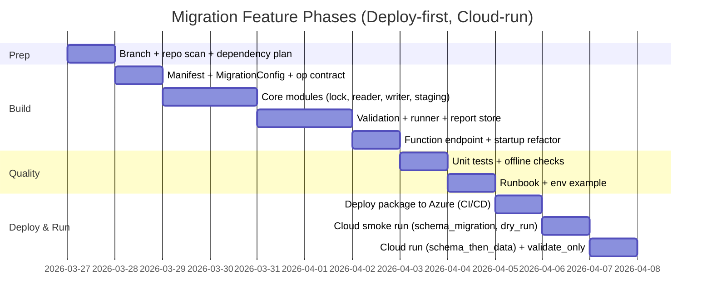

# Migration Feature Plan for the Existing Azure Function App

## Executive summary

You want **one deployed Azure Function App** that you can manually invoke to run **explicit operations**:

- `schema_migration` (no-op if already up to date)
- `data_migration` (Parquet → Azure SQL, idempotent)
- `schema_then_data`
- `dry_run` (no DB writes)
- `validate_only` (compare source vs target without writing)

This plan adds that capability **without running schema migration at startup**, and **reuses your existing code patterns**: `Config`, `MSSqlDatabase`, `SchemaManager`, and the same `sp_getapplock` locking style as `SchemaLockManager`. It supports **Blob and Local** Parquet sources, but assumes **actual execution happens only after deployment to Azure**, because local cannot reach cloud. The data pipeline is **staging → validate → atomic replace**, with batch reads via **pyarrow**, checksum via **`pandas.util.hash_pandas_object` + XOR reduce**, and **N=50 fixed-seed spot checks**.

Primary/official guidance referenced where relevant: Azure Functions Python programming model, HTTP trigger behavior, function keys, Azure SQL auth via ODBC/Entra ID, SQL Server app locks (`sp_getapplock`/`sp_releaseapplock`), SQLAlchemy `fast_executemany`, and `TRUNCATE TABLE` rollback behavior. citeturn0search0turn0search3turn0search7turn1search0turn0search4turn0search0turn0search1turn0search2

## Assumptions and constraints

### Assumptions (explicitly stated)
- **APP_ROOT** = the folder that contains `host.json`, `requirements.txt`, and the main `function_app.py` (Azure Functions Python v2 programming model). Confirm by searching for `app = func.FunctionApp(...)`. citeturn0search0turn0search3
- Target Azure SQL tables already exist (per ticket). No schema changes to business tables.
- There is a way to **deploy** to Azure (CI/CD or an allowed network route). Local machine cannot reliably call Azure endpoints, so **pre-deploy validation must be mostly offline**.
- The Function App’s Managed Identity will have Azure SQL permissions configured (DB user + roles). (Implementation plan includes post-deploy verification.)

### Constraints (from you)
- Do **not** run schema migration automatically at startup.
- Execution happens in Azure only: “deploy first, run in cloud”.
- Reuse: existing Function App, `Config`, `MSSqlDatabase`, `SchemaManager`, `SchemaLockManager` pattern.
- Support Parquet sources: local and Blob (Blob is the expected production mode).
- Idempotent data flow: staging → validate → atomic replace.
- Batch reads: pyarrow
- Checksum: pandas.util.hash_pandas_object + XOR reduce
- Spot-check: N=50 fixed seed
- Locking: table-level `data_migration_lock:<schema>.<table>` using `sp_getapplock`
- Staging via: `SELECT TOP 0 ... INTO`
- Identity columns: `SET IDENTITY_INSERT ON/OFF`
- Use `fast_executemany` where safe (pyodbc via SQLAlchemy). citeturn0search1
- Add HTTP trigger: `POST /operations/run` with a defined contract.
- Reports saved to Blob.

## Target architecture and operation contract

### High-level behavior
- The Function App starts normally and loads config/DB engine **but does not execute schema migration**.
- A single HTTP-trigger endpoint `/operations/run` dispatches to one of the operations.
- All operations return a **deterministic JSON response** and store a **run report** to Blob.

### Operation semantics (deterministic)
| Operation | Writes schema? | Writes data? | Reads source? | Reads target? | Purpose |
|---|---:|---:|---:|---:|---|
| `schema_migration` | ✅ | ❌ | ❌ | ✅ | Upgrade/init schema explicitly; no-op if already up-to-date |
| `data_migration` | ❌ | ✅ | ✅ | ✅ | Load Parquet → staging → validate → replace |
| `schema_then_data` | ✅ | ✅ | ✅ | ✅ | `schema_migration` then `data_migration` |
| `dry_run` | ❌ | ❌ | ✅ | ✅ (optional) | Validate manifest, schema mapping, compute source stats, check target table exists; no DB writes |
| `validate_only` | ❌ | ❌ | ✅ | ✅ | Compare source vs target parity without writing |

### HTTP auth and keys (recommended)
Use `FUNCTION` auth level so you can run it manually from Azure Portal or a secure client with function keys. citeturn0search7

### Official references (why these choices are safe)
- Azure Functions Python v2 `FunctionApp` model and decorators. citeturn0search0
- HTTP Trigger behavior. citeturn0search3
- Function keys for HTTP authorization. citeturn0search7
- ODBC + Microsoft Entra ID guidance (aligns with your existing access-token-based approach). citeturn1search0
- SQL Server application locks (`sp_getapplock` / `sp_releaseapplock`) for exclusive run control. citeturn0search4turn0search0
- `fast_executemany=True` supported by SQLAlchemy’s pyodbc dialect for performance. citeturn0search1
- `TRUNCATE TABLE` can be rolled back inside a transaction (enables atomic replace safety). citeturn0search2

## File list and exact paths to add/modify

Define a single variable for clarity:

- **`APP_ROOT/`** = the Azure Function App root (contains `function_app.py`, `host.json`, `requirements.txt`).

From your screenshots, there is an existing package folder that looks like: `APP_ROOT/service/shared/database/...`. If your repo differs, the deterministic rule is: **place new modules next to existing DB code** (the folder that already contains `mssql.py`).

### Modify (existing)
1. `APP_ROOT/function_app.py`
   - Remove/disable any automatic schema migration call at import/startup.
   - Add new HTTP trigger `POST /operations/run`.
2. `APP_ROOT/.env.example` (or the existing example env file)
   - Add migration-related env vars.
3. `APP_ROOT/requirements.txt`
   - Ensure `pyarrow`, `pandas` are listed (and `azure-storage-blob` if not already present).

### Add (new)
Assuming your DB modules are under `APP_ROOT/service/shared/database/`, add:

- `APP_ROOT/service/shared/database/DataMigration/__init__.py`
- `APP_ROOT/service/shared/database/DataMigration/migration_config.py`
- `APP_ROOT/service/shared/database/DataMigration/migration_manifest.json`
- `APP_ROOT/service/shared/database/DataMigration/data_migration_lock_manager.py`
- `APP_ROOT/service/shared/database/DataMigration/parquet_reader.py`
- `APP_ROOT/service/shared/database/DataMigration/sql_introspection.py`
- `APP_ROOT/service/shared/database/DataMigration/staging.py`
- `APP_ROOT/service/shared/database/DataMigration/sql_writer.py`
- `APP_ROOT/service/shared/database/DataMigration/validation.py`
- `APP_ROOT/service/shared/database/DataMigration/migration_runner.py`
- `APP_ROOT/service/shared/database/DataMigration/report_store.py`
- `APP_ROOT/service/shared/database/DataMigration/operation_models.py` (request/response dataclasses + validation)

Tests:
- `APP_ROOT/tests/test_manifest.py`
- `APP_ROOT/tests/test_migration_config.py`
- `APP_ROOT/tests/test_checksum.py`
- `APP_ROOT/tests/test_spotcheck_sampling.py`
- `APP_ROOT/tests/test_sql_rendering.py` (unit tests for generated SQL strings; no DB needed)
- `APP_ROOT/tests/integration/README.md` (instructions to run post-deploy)

Docs:
- `APP_ROOT/docs/runbooks/migration_operations_runbook.md`
- `APP_ROOT/docs/migration/architecture.md` (optional but recommended)

### Deliverables table (quick checklist)
| Deliverable | Path | Type |
|---|---|---|
| Operation endpoint | `APP_ROOT/function_app.py` | code |
| Manifest | `.../migration_manifest.json` | file |
| Migration config loader | `.../migration_config.py` | code |
| Parquet batch reader | `.../parquet_reader.py` | code |
| Lock manager | `.../data_migration_lock_manager.py` | code |
| Staging + atomic replace | `.../staging.py` + `.../migration_runner.py` | code |
| Writer (fast inserts) | `.../sql_writer.py` | code |
| Validation (checksum+spotcheck) | `.../validation.py` | code |
| Report store to Blob | `.../report_store.py` | code |
| Unit tests | `APP_ROOT/tests/...` | tests |
| Runbook | `APP_ROOT/docs/runbooks/...` | docs |
| Env keys | `APP_ROOT/.env.example` | config |

## Code skeletons and pseudocode (module-by-module)

The pseudocode below is intentionally “copy/paste scaffoldable”.

### `migration_manifest.json` (exact fields)

Example (expand with your full dataset list):

```json
{
  "run_defaults": {
    "target_schema": "dbo",
    "batch_rows": 50000,
    "spot_check_n": 50
  },
  "datasets": [
    {
      "name": "rpt2_inpay_table",
      "parquet_file": "rpt2_inpay_table.parquet",
      "target_schema": "dbo",
      "target_table": "rpt2_inpay_table"
    }
  ]
}
```

Manifest field meaning (deterministic)
| Field | Required | Meaning |
|---|---:|---|
| `datasets[].name` | ✅ | Logical dataset id used in operations payload |
| `datasets[].parquet_file` | ✅ | File name inside source location (local dir or blob prefix) |
| `datasets[].target_schema` | optional | Defaulted from `run_defaults.target_schema` |
| `datasets[].target_table` | ✅ | Target Azure SQL table name |
| `run_defaults.batch_rows` | optional | Default batch size |
| `run_defaults.spot_check_n` | optional | Default sample size |

### `migration_config.py`

```python
import os
from dataclasses import dataclass
from enum import Enum

class MigrationSourceType(str, Enum):
    LOCAL = "local"
    BLOB = "blob"

@dataclass(frozen=True)
class MigrationConfigData:
    source_type: MigrationSourceType
    local_parquet_dir: str | None
    blob_container: str | None
    blob_connection_setting: str
    manifest_path: str
    report_container: str
    report_prefix: str
    batch_rows_default: int
    spot_check_n_default: int

class MigrationConfig:
    _instance: MigrationConfigData | None = None

    @classmethod
    def load_from_env(cls) -> MigrationConfigData:
        source_type = MigrationSourceType(os.getenv("MIGRATION_SOURCE_TYPE", "blob"))
        local_dir = os.getenv("MIGRATION_LOCAL_PARQUET_DIR")
        blob_container = os.getenv("MIGRATION_BLOB_CONTAINER")
        blob_conn = os.getenv("MIGRATION_BLOB_CONNECTION", "AzureWebJobsStorage")

        manifest_path = os.getenv("MIGRATION_MANIFEST_PATH", "./service/shared/database/DataMigration/migration_manifest.json")
        report_container = os.getenv("MIGRATION_REPORT_CONTAINER", "migration-reports")
        report_prefix = os.getenv("MIGRATION_REPORT_PREFIX", "runs")

        batch_rows = int(os.getenv("MIGRATION_BATCH_ROWS_DEFAULT", "50000"))
        spot_n = int(os.getenv("MIGRATION_SPOT_CHECK_N_DEFAULT", "50"))

        missing = []
        if source_type == MigrationSourceType.LOCAL and not local_dir:
            missing.append("MIGRATION_LOCAL_PARQUET_DIR")
        if source_type == MigrationSourceType.BLOB and not blob_container:
            missing.append("MIGRATION_BLOB_CONTAINER")
        if missing:
            raise RuntimeError(f"Missing migration configuration: {', '.join(missing)}")

        data = MigrationConfigData(
            source_type=source_type,
            local_parquet_dir=local_dir,
            blob_container=blob_container,
            blob_connection_setting=blob_conn,
            manifest_path=manifest_path,
            report_container=report_container,
            report_prefix=report_prefix,
            batch_rows_default=batch_rows,
            spot_check_n_default=spot_n,
        )
        cls._instance = data
        return data

    @classmethod
    def instance(cls) -> MigrationConfigData:
        if cls._instance is None:
            raise RuntimeError("MigrationConfig not loaded. Call MigrationConfig.load_from_env() first.")
        return cls._instance
```

### `data_migration_lock_manager.py` (sp_getapplock, table-level resource)

Use the same pattern as your existing `SchemaLockManager`, but resource must include table:

```python
import time
import logging
from sqlalchemy import text
from sqlalchemy.engine import Connection

logger = logging.getLogger(__name__)

_ACQUIRE_SQL = """
DECLARE @result INT;
EXEC @result = sp_getapplock
    @Resource = :resource,
    @LockMode = 'Exclusive',
    @LockOwner = 'Session',
    @LockTimeout = 0;
SELECT @result;
"""

_RELEASE_SQL = """
EXEC sp_releaseapplock
    @Resource = :resource,
    @LockOwner = 'Session';
"""

class DataMigrationLockManager:
    def __init__(self, conn: Connection, resource: str, timeout_sec: int = 120):
        self.conn = conn
        self.resource = resource
        self.timeout_sec = timeout_sec

    def __enter__(self):
        deadline = time.monotonic() + self.timeout_sec
        while time.monotonic() < deadline:
            code = self.conn.execute(text(_ACQUIRE_SQL), {"resource": self.resource}).scalar()
            if code in (0, 1):  # granted
                logger.info("data migration lock acquired", extra={"resource": self.resource, "code": code})
                return self
            if code == -1:  # timeout
                time.sleep(3)
                continue
            raise RuntimeError(f"Cannot acquire data migration lock. code={code}")
        raise TimeoutError(f"Timeout waiting for data migration lock: {self.resource}")

    def __exit__(self, exc_type, exc, tb):
        try:
            self.conn.execute(text(_RELEASE_SQL), {"resource": self.resource})
            logger.info("data migration lock released", extra={"resource": self.resource})
        except Exception:
            logger.exception("failed to release data migration lock", extra={"resource": self.resource})
```

Reference for expected behavior and release rules. citeturn0search4turn0search0

### `parquet_reader.py` (pyarrow batch iteration)

```python
import io
import logging
import pandas as pd
import pyarrow.parquet as pq
from dataclasses import dataclass
from typing import Iterator

logger = logging.getLogger(__name__)

@dataclass(frozen=True)
class ParquetBatch:
    batch_id: int
    df: pd.DataFrame
    row_count: int

class ParquetBatchReader:
    def __init__(self, open_stream_fn, batch_rows: int):
        """
        open_stream_fn: () -> BinaryIO
          - for LOCAL: open(path, "rb")
          - for BLOB: download blob to bytes, return BytesIO
        """
        self.open_stream_fn = open_stream_fn
        self.batch_rows = batch_rows

    def iter_batches(self) -> Iterator[ParquetBatch]:
        with self.open_stream_fn() as stream:
            pf = pq.ParquetFile(stream)
            batch_id = 0
            for rb in pf.iter_batches(batch_size=self.batch_rows):
                df = rb.to_pandas()
                yield ParquetBatch(batch_id=batch_id, df=df, row_count=len(df))
                batch_id += 1

    def read_arrow_schema(self):
        with self.open_stream_fn() as stream:
            return pq.ParquetFile(stream).schema_arrow

    def count_rows(self) -> int:
        total = 0
        for batch in self.iter_batches():
            total += batch.row_count
        return total
```

### `sql_introspection.py` (columns, identity, computed)

```python
from sqlalchemy import text
from sqlalchemy.engine import Engine
from dataclasses import dataclass

@dataclass(frozen=True)
class ColumnInfo:
    name: str
    is_identity: bool
    is_computed: bool
    is_nullable: bool

def get_columns(engine: Engine, schema: str, table: str) -> list[ColumnInfo]:
    sql = """
    SELECT
        c.name AS column_name,
        c.is_identity,
        c.is_computed,
        c.is_nullable
    FROM sys.columns c
    JOIN sys.tables t ON c.object_id = t.object_id
    JOIN sys.schemas s ON t.schema_id = s.schema_id
    WHERE s.name = :schema AND t.name = :table
    ORDER BY c.column_id;
    """
    with engine.connect() as conn:
        rows = conn.execute(text(sql), {"schema": schema, "table": table}).mappings().all()
    return [
        ColumnInfo(
            name=r["column_name"],
            is_identity=bool(r["is_identity"]),
            is_computed=bool(r["is_computed"]),
            is_nullable=bool(r["is_nullable"]),
        )
        for r in rows
    ]
```

### `staging.py` (SELECT TOP 0 INTO + drop-if-exists)

Exact SQL snippets (required by your constraints):

```sql
-- drop-if-exists
IF OBJECT_ID('[dbo].[<staging_table>]', 'U') IS NOT NULL
    DROP TABLE [dbo].[<staging_table>];

-- create staging with same columns/types
SELECT TOP (0) *
INTO [dbo].[<staging_table>]
FROM [dbo].[<target_table>];
```

Python wrapper:

```python
from sqlalchemy import text
from sqlalchemy.engine import Engine

def drop_table_if_exists(engine: Engine, schema: str, table: str) -> None:
    sql = f"IF OBJECT_ID('[{schema}].[{table}]', 'U') IS NOT NULL DROP TABLE [{schema}].[{table}];"
    with engine.begin() as conn:
        conn.execute(text(sql))

def create_staging_from_target(engine: Engine, schema: str, target_table: str, staging_table: str) -> None:
    sql = f"SELECT TOP (0) * INTO [{schema}].[{staging_table}] FROM [{schema}].[{target_table}];"
    with engine.begin() as conn:
        conn.execute(text(sql))
```

### `sql_writer.py` (to_sql + fast_executemany + identity)

At engine creation time, SQLAlchemy supports `fast_executemany=True` for pyodbc (Microsoft ODBC driver). citeturn0search1

Strategy:
- Prefer **creating a dedicated “fast” engine** for migration rather than changing global engine behavior (reduces blast radius).
- Only enable `fast_executemany` on the migration engine.

```python
import logging
import pandas as pd
from sqlalchemy import text, create_engine
from sqlalchemy.engine import Engine
from service.shared.database.mssql import MSSqlDatabase, MSSqlDatabaseConfig  # adjust import to your repo

logger = logging.getLogger(__name__)

def get_migration_engine_fast() -> Engine:
    # Reuse existing config for URL+token args, but build a new engine instance for migration.
    db = MSSqlDatabase()
    db_config = MSSqlDatabaseConfig.get_configs_from_env()  # or from AppConfig.instance()
    return create_engine(
        db_config.get_db_connection_string(),
        connect_args=db_config.get_connect_args(),
        fast_executemany=True,
        pool_pre_ping=True,
    )

def set_identity_insert(conn, schema: str, table: str, enabled: bool) -> None:
    onoff = "ON" if enabled else "OFF"
    conn.execute(text(f"SET IDENTITY_INSERT [{schema}].[{table}] {onoff};"))

def append_df(engine: Engine, schema: str, table: str, df: pd.DataFrame, identity_insert: bool) -> int:
    with engine.begin() as conn:
        if identity_insert:
            set_identity_insert(conn, schema, table, True)
        try:
            df.to_sql(
                name=table,
                schema=schema,
                con=conn,
                if_exists="append",
                index=False,
                method="multi",
                chunksize=5000,
            )
        finally:
            if identity_insert:
                set_identity_insert(conn, schema, table, False)
    return len(df)
```

### `validation.py` (checksum XOR + fixed-seed spot check)

Checksum rule (deterministic):
- For each batch DataFrame: `hash_series = pd.util.hash_pandas_object(df, index=False)`
- Reduce to uint64 using XOR
- Overall checksum = XOR of batch XORs

Spot check rule:
- Fixed seed derived from `run_id` (e.g., hash of run_id string)
- Sample exactly `N=50` rows **from source** during read and store their row-hash.
- After load, sample `N=50` rows from staging/target in the same way and compare hash multisets.

```python
import pandas as pd
import numpy as np
import logging
from dataclasses import dataclass
from sqlalchemy import text
from sqlalchemy.engine import Engine

logger = logging.getLogger(__name__)

@dataclass(frozen=True)
class DataStats:
    row_count: int
    checksum_xor64: int
    spot_hashes: list[int]

def xor_reduce_u64(arr: pd.Series) -> int:
    # ensure uint64
    x = np.uint64(0)
    for v in arr.astype("uint64").to_numpy():
        x ^= np.uint64(v)
    return int(x)

def df_hashes(df: pd.DataFrame) -> pd.Series:
    return pd.util.hash_pandas_object(df, index=False)

def compute_source_stats(reader, spot_n: int, seed: int) -> DataStats:
    total_rows = 0
    checksum = np.uint64(0)
    spot_hashes: list[int] = []

    rng = np.random.default_rng(seed)

    for batch in reader.iter_batches():
        df = batch.df
        total_rows += len(df)

        batch_checksum = xor_reduce_u64(df_hashes(df))
        checksum ^= np.uint64(batch_checksum)

        # reservoir-style sampling (simple deterministic approach)
        # For simplicity: sample from each batch and take first N overall
        if len(spot_hashes) < spot_n and len(df) > 0:
            take = min(spot_n - len(spot_hashes), len(df))
            idx = rng.choice(len(df), size=take, replace=False)
            spot_hashes.extend(df_hashes(df.iloc[idx]).astype("uint64").tolist())

    return DataStats(row_count=total_rows, checksum_xor64=int(checksum), spot_hashes=spot_hashes)

def iter_db_table_in_batches(engine: Engine, schema: str, table: str, columns: list[str], batch_rows: int):
    cols_sql = ", ".join(f"[{c}]" for c in columns)
    # Note: need deterministic paging; simplest is OFFSET/FETCH with ORDER BY (requires key).
    # If no key: use identity/computed row_number over (select 1) - heavier.
    # Practical deterministic approach for validate_only: accept non-deterministic order since checksum is XOR/order-independent.
    sql = f"SELECT {cols_sql} FROM [{schema}].[{table}];"
    # Stream result in chunks:
    with engine.connect() as conn:
        result = conn.execution_options(stream_results=True).execute(text(sql))
        rows = []
        for row in result:
            rows.append(row)
            if len(rows) >= batch_rows:
                yield pd.DataFrame(rows, columns=columns)
                rows = []
        if rows:
            yield pd.DataFrame(rows, columns=columns)

def compute_db_stats(engine: Engine, schema: str, table: str, columns: list[str], spot_n: int, seed: int, batch_rows: int) -> DataStats:
    total_rows = 0
    checksum = np.uint64(0)
    all_spot_hashes: list[int] = []

    rng = np.random.default_rng(seed)

    for df in iter_db_table_in_batches(engine, schema, table, columns, batch_rows=batch_rows):
        total_rows += len(df)
        checksum ^= np.uint64(xor_reduce_u64(df_hashes(df)))

        if len(all_spot_hashes) < spot_n and len(df) > 0:
            take = min(spot_n - len(all_spot_hashes), len(df))
            idx = rng.choice(len(df), size=take, replace=False)
            all_spot_hashes.extend(df_hashes(df.iloc[idx]).astype("uint64").tolist())

    return DataStats(row_count=total_rows, checksum_xor64=int(checksum), spot_hashes=all_spot_hashes)

def compare_stats(source: DataStats, db: DataStats) -> dict:
    return {
        "row_count_match": source.row_count == db.row_count,
        "checksum_match": source.checksum_xor64 == db.checksum_xor64,
        "spot_check_match": sorted(source.spot_hashes) == sorted(db.spot_hashes),
    }
```

### `migration_runner.py` (staging → validate → atomic replace)

Atomic replace uses a transaction and can safely rollback `TRUNCATE TABLE` inside that transaction. citeturn0search2

Exact SQL snippets for replace:

```sql
BEGIN TRAN;

TRUNCATE TABLE [dbo].[<target_table>];

-- Only if identity_insert needed:
SET IDENTITY_INSERT [dbo].[<target_table>] ON;

INSERT INTO [dbo].[<target_table>] ([col1],[col2],...)
SELECT [col1],[col2],...
FROM [dbo].[<staging_table>];

SET IDENTITY_INSERT [dbo].[<target_table>] OFF;

COMMIT TRAN;
```

Runner pseudocode:

```python
import time
import logging
from dataclasses import dataclass
from sqlalchemy import text
from sqlalchemy.engine import Engine
from .data_migration_lock_manager import DataMigrationLockManager
from .staging import drop_table_if_exists, create_staging_from_target
from .sql_introspection import get_columns
from .sql_writer import append_df, get_migration_engine_fast
from .validation import compute_source_stats, compute_db_stats, compare_stats

logger = logging.getLogger(__name__)

@dataclass
class TableRunResult:
    dataset: str
    schema: str
    table: str
    staging_table: str
    status: str
    source_rows: int
    staging_rows: int
    checksum_match: bool
    row_count_match: bool
    spot_check_match: bool
    duration_sec: float
    error: str | None

def atomic_replace(engine: Engine, schema: str, target: str, staging: str, insert_columns: list[str], identity_insert: bool) -> None:
    cols = ", ".join(f"[{c}]" for c in insert_columns)
    sql_parts = [
        "BEGIN TRAN;",
        f"TRUNCATE TABLE [{schema}].[{target}];",
    ]
    if identity_insert:
        sql_parts.append(f"SET IDENTITY_INSERT [{schema}].[{target}] ON;")
    sql_parts.append(
        f"INSERT INTO [{schema}].[{target}] ({cols}) SELECT {cols} FROM [{schema}].[{staging}];"
    )
    if identity_insert:
        sql_parts.append(f"SET IDENTITY_INSERT [{schema}].[{target}] OFF;")
    sql_parts.append("COMMIT TRAN;")
    sql = "\n".join(sql_parts)
    with engine.begin() as conn:
        conn.execute(text(sql))

def migrate_one_dataset(
    run_id: str,
    dataset: dict,
    parquet_reader,
    engine_fast: Engine,
    batch_rows: int,
    spot_n: int,
) -> TableRunResult:
    t0 = time.time()
    schema = dataset["target_schema"]
    table = dataset["target_table"]
    staging_table = f"{table}__stg__{run_id.replace(':','').replace('-','')}".lower()

    try:
        columns = get_columns(engine_fast, schema, table)
        insert_cols = [c.name for c in columns if not c.is_computed]
        identity_cols = [c.name for c in columns if c.is_identity]
        identity_insert = len(identity_cols) > 0 and all(col in insert_cols for col in identity_cols)

        # lock resource is table-specific
        lock_resource = f"data_migration_lock:{schema}.{table}"

        with engine_fast.connect() as conn:
            with DataMigrationLockManager(conn, lock_resource, timeout_sec=120):
                drop_table_if_exists(engine_fast, schema, staging_table)
                create_staging_from_target(engine_fast, schema, table, staging_table)

                seed = abs(hash(run_id)) % (2**32)

                source_stats = compute_source_stats(parquet_reader, spot_n=spot_n, seed=seed)

                # load batches into staging
                total_inserted = 0
                for batch in parquet_reader.iter_batches():
                    df = batch.df
                    df = df[[c for c in insert_cols if c in df.columns]]  # filter
                    total_inserted += append_df(engine_fast, schema, staging_table, df, identity_insert=identity_insert)

                staging_stats = compute_db_stats(
                    engine_fast, schema, staging_table, columns=[c for c in insert_cols], spot_n=spot_n, seed=seed, batch_rows=batch_rows
                )

                checks = compare_stats(source_stats, staging_stats)
                if not all(checks.values()):
                    raise RuntimeError(f"Validation failed: {checks}")

                # replace target atomically
                atomic_replace(engine_fast, schema, table, staging_table, insert_columns=insert_cols, identity_insert=identity_insert)

                # optional: validate target matches staging (recommended)
                # target_stats = compute_db_stats(...)

                drop_table_if_exists(engine_fast, schema, staging_table)

        dt = time.time() - t0
        return TableRunResult(
            dataset=dataset["name"],
            schema=schema,
            table=table,
            staging_table=staging_table,
            status="success",
            source_rows=source_stats.row_count,
            staging_rows=staging_stats.row_count,
            checksum_match=checks["checksum_match"],
            row_count_match=checks["row_count_match"],
            spot_check_match=checks["spot_check_match"],
            duration_sec=dt,
            error=None,
        )

    except Exception as e:
        dt = time.time() - t0
        logger.exception("dataset migration failed", extra={"dataset": dataset["name"], "table": table, "run_id": run_id})
        return TableRunResult(
            dataset=dataset["name"],
            schema=schema,
            table=table,
            staging_table=staging_table,
            status="failed",
            source_rows=0,
            staging_rows=0,
            checksum_match=False,
            row_count_match=False,
            spot_check_match=False,
            duration_sec=dt,
            error=str(e),
        )
```

### `report_store.py` (save run report to Blob)

Reuse your existing blob code pattern (BlobServiceClient + DefaultAzureCredential). Your codebase already uses it in other functions. For the plan, keep it simple:

```python
import json
import logging
from azure.identity import DefaultAzureCredential
from azure.storage.blob import BlobServiceClient

logger = logging.getLogger(__name__)

def save_report_to_blob(storage_endpoint: str, container: str, blob_path: str, report: dict) -> None:
    credential = DefaultAzureCredential(exclude_interactive_browser_credential=False)
    blob_service = BlobServiceClient(account_url=storage_endpoint, credential=credential)
    client = blob_service.get_blob_client(container=container, blob=blob_path)
    payload = json.dumps(report, indent=2).encode("utf-8")
    client.upload_blob(payload, overwrite=True)
    logger.info("report uploaded", extra={"container": container, "blob": blob_path})
```

### `operation_models.py` (request/response schemas)

Deterministic request structure:

```python
from dataclasses import dataclass
from enum import Enum
from typing import Any

class Operation(str, Enum):
    SCHEMA_MIGRATION = "schema_migration"
    DATA_MIGRATION = "data_migration"
    SCHEMA_THEN_DATA = "schema_then_data"
    DRY_RUN = "dry_run"
    VALIDATE_ONLY = "validate_only"

@dataclass(frozen=True)
class OperationRequest:
    operation: Operation
    run_id: str
    datasets: list[str] | None
    overrides: dict[str, Any] | None
    continue_on_error: bool
    source_override: dict[str, Any] | None  # optional override for blob/local location

@dataclass
class OperationResponse:
    run_id: str
    operation: str
    status: str
    started_at: str
    ended_at: str
    results: list[dict]
    report_location: str | None
    error: str | None
```

## HTTP endpoint: exact payload and response schemas

### Endpoint
- **Method:** `POST`
- **Route:** `/operations/run` (Azure Functions v2 `@app.route(route="operations/run", ...)`) citeturn0search0turn0search3
- **Auth level:** `FUNCTION` recommended (function key required). citeturn0search7

### Request JSON schema (exact contract)

```json
{
  "operation": "schema_migration | data_migration | schema_then_data | dry_run | validate_only",
  "run_id": "2026-03-27T21:15:00Z",
  "datasets": ["rpt2_inpay_table", "rpt2_summary_report_table"],
  "continue_on_error": false,
  "overrides": {
    "batch_rows": 50000,
    "spot_check_n": 50
  },
  "source_override": {
    "source_type": "blob",
    "blob_container": "env-prt-parquet-migration",
    "blob_prefix": "prod/2026-03-27/"
  }
}
```

Rules:
- `datasets`:
  - Required for `data_migration`, `schema_then_data`, `dry_run`, `validate_only`
  - Optional means “all datasets in manifest”
- `overrides` optional; fall back to manifest defaults and env defaults.

### Response JSON schema (exact)

```json
{
  "run_id": "2026-03-27T21:15:00Z",
  "operation": "data_migration",
  "status": "success | failed | partial_success",
  "started_at": "2026-03-27T21:15:03Z",
  "ended_at": "2026-03-27T21:22:45Z",
  "results": [
    {
      "dataset": "rpt2_inpay_table",
      "target": "dbo.rpt2_inpay_table",
      "status": "success",
      "source_rows": 123,
      "target_rows": 123,
      "checksum_match": true,
      "spot_check_match": true,
      "duration_sec": 412.3
    }
  ],
  "report_location": "blob://<report_container>/<report_prefix>/<run_id>.json",
  "error": null
}
```

Status logic:
- `success`: all datasets success
- `partial_success`: some success, some failed, and `continue_on_error=true`
- `failed`: any failure and `continue_on_error=false`

## `function_app.py` precise changes

### Required change: remove automatic schema migration on startup
Your screenshots show a startup sequence calling `SchemaManager().run()` automatically. The plan requires removing that; keep only lightweight initialization.

### Add the dispatcher endpoint
Use Azure Functions Python v2 `FunctionApp` and `@app.route`. citeturn0search0turn0search3

Pseudocode:

```python
import json
import logging
import azure.functions as func

from config import Config  # adjust to your repo
from service.shared.database.mssql import MSSqlDatabase
from schema_manager import SchemaManager
from service.shared.database.DataMigration.migration_config import MigrationConfig
from service.shared.database.DataMigration.migration_runner import run_operation  # you implement

logger = logging.getLogger(__name__)

app = func.FunctionApp(http_auth_level=func.AuthLevel.FUNCTION)

# STARTUP: keep config + db engine initialization, but DO NOT run schema migration.
Config.load_from_file()
MSSqlDatabase()  # engine init only

@app.route(route="operations/run", methods=["POST"])
def operations_run(req: func.HttpRequest) -> func.HttpResponse:
    try:
        payload = req.get_json()
        result = run_operation(payload)  # returns dict response + writes blob report
        return func.HttpResponse(
            body=json.dumps(result, indent=2),
            status_code=200 if result["status"] != "failed" else 500,
            mimetype="application/json",
        )
    except ValueError:
        return func.HttpResponse("Invalid JSON body", status_code=400)
    except Exception as e:
        logger.exception("operation failed")
        return func.HttpResponse(f"Operation failed: {e}", status_code=500)
```

## Step-by-step agent actions (commands and checkpoints)

Because your local environment cannot reliably connect to Azure, the plan separates:

- **Offline pre-deploy steps** (no cloud calls)
- **Post-deploy smoke steps** (run inside Azure via Portal/Test Run)

### Phase timeline (Mermaid)



### Offline pre-deploy (no cloud calls)

1) Create branch
```bash
git checkout -b feature/migration-operations
```

2) Add modules + manifest + docs exactly as listed above.

3) Dependencies (offline-friendly approach)
- If you cannot `pip install` from the internet:
  - Use an internal artifact feed / pre-approved wheelhouse in CI
  - OR vendor wheels checked into a private repo store (company standard)
- Update `requirements.txt` but rely on CI to resolve packages.

4) Run offline checks
```bash
python -m compileall APP_ROOT
pytest -q
```

5) Create deployment package (CI recommended)
- Deterministic build step (typical Azure Functions Python):
```bash
pip install -r requirements.txt --target=.python_packages/lib/site-packages
```
(Do this in CI where packages are available.)

### Deploy (cloud)
Because local CLI cannot reach Azure reliably, use one of:
- CI/CD pipeline deployment
- Azure DevOps build artifact → release
- A machine/network segment that can deploy

### Post-deploy smoke (in Azure Portal / Cloud console)
Run these operations in order:

1) `schema_migration`  
2) `dry_run` on one small dataset  
3) `validate_only` on that dataset  
4) `schema_then_data` for full migration window  

## Testing plan (unit + integration) with sample cases

### Unit tests (offline)
These require **zero DB connectivity**.

1) `test_manifest.py`
- load `migration_manifest.json`
- validate required keys
- ensure dataset names unique

2) `test_migration_config.py`
- missing env vars raise clean error
- blob/local branches validated

3) `test_checksum.py`
- same df → same checksum
- one cell changed → checksum differs

4) `test_spotcheck_sampling.py`
- fixed seed returns same sample list across runs

5) `test_sql_rendering.py`
- verify staging SQL contains `SELECT TOP (0) * INTO`
- verify replace SQL structure includes `BEGIN TRAN` and `COMMIT TRAN`

### Integration tests (cloud-only)
Since you cannot connect locally:
- Provide **runbook-driven integration** executed after deploy.

Minimum integration cases:
1) `schema_migration` returns no-op when already latest (run twice)
2) `dry_run` reads Parquet from Blob and validates mapping without DB writes
3) `data_migration` on one small table
4) rerun same `data_migration` (idempotency)
5) interrupt scenario (optional) — force an exception mid-load and verify target unchanged (atomicity)

## Runbook outline (with commands and SQL snippets)

Create: `docs/runbooks/migration_operations_runbook.md`

### Sections (required)
1) Prerequisites
- Function deployed
- Managed Identity granted access to Azure SQL
- Blob container has Parquet files
- App settings configured (env vars)

2) Configure App Settings (Azure)
- Set all `.env.example` keys in Function App Configuration.

3) Execution (Azure Portal)
- Use “Test/Run” or HTTP call with function key.

Example payload: schema then data:

```json
{
  "operation": "schema_then_data",
  "run_id": "2026-03-27T21:15:00Z",
  "datasets": null,
  "continue_on_error": false,
  "overrides": { "batch_rows": 50000, "spot_check_n": 50 }
}
```

4) Validation SQL snippets

Row count:
```sql
SELECT COUNT(*) AS row_count FROM [dbo].[rpt2_inpay_table];
```

Check staging remnants:
```sql
SELECT name FROM sys.tables WHERE name LIKE '%__stg__%';
```

5) Rollback strategy

Primary rollback is automatic via transaction:
- If validation fails before replace → target untouched
- If replace fails inside transaction → rollback restores previous state  
`TRUNCATE TABLE` inside a transaction can be rolled back per SQL Server docs. citeturn0search2

Manual rollback options:
- Re-run the migration with last known good Parquet set.
- DB-level restore (if your org requires it).

6) Rerun instructions
- Re-run specific dataset by passing `datasets=[...]`.
- Re-run all by passing `datasets=null`.

7) Evidence package
- Link to blob report
- Logs with run_id
- Timings summary

## `.env.example` keys (complete list)

Add these to your existing `.env.example`. (Use Azure App Settings in production.)

### Existing DB keys (already in your codebase)
- `RUNTIME_CONTEXT=local|cloud`
- `DB_HOST=...`
- `DB_DRIVER_NAME=ODBC Driver 18 for SQL Server`
- `DB_DATABASE_NAME=...`
- `DB_AUTHENTICATION_METHOD=windows_auth|uami`
- `DB_TRUSTED_CONNECTION=yes|no`
- `DB_DRIVER_TYPE=pyodbc`
- `DB_ALEMBIC_INI_PATH=...`
- `DB_MIGRATION_TARGET_VERSION=head`
- `DB_SCHEMA_VERSION_DIR=...`

### Migration keys (new)
- `MIGRATION_SOURCE_TYPE=blob|local`
- `MIGRATION_LOCAL_PARQUET_DIR=...` (only if local)
- `MIGRATION_BLOB_CONTAINER=...` (required for blob)
- `MIGRATION_BLOB_CONNECTION=AzureWebJobsStorage`
- `MIGRATION_MANIFEST_PATH=./service/shared/database/DataMigration/migration_manifest.json`
- `MIGRATION_REPORT_CONTAINER=...`
- `MIGRATION_REPORT_PREFIX=runs`
- `MIGRATION_BATCH_ROWS_DEFAULT=50000`
- `MIGRATION_SPOT_CHECK_N_DEFAULT=50`

## Acceptance checklist mapping to the ticket DoD

This is the “release gate” checklist:

1) End-to-End Migration Executed  
- [ ] Every dataset in manifest can be migrated to its target table (or exceptions documented)

2) Idempotency & Safety  
- [ ] Rerun `data_migration` twice for same dataset → rowcount/checksum/spotcheck pass
- [ ] Forced failure before replace leaves target unchanged
- [ ] No concurrent run on same table (lock enforced)

3) Validation  
- [ ] Row counts match (source vs staging; staging vs target)
- [ ] Checksum XOR64 matches
- [ ] Spot-check N=50 matches
- [ ] Schema/type mapping report produced (coercions recorded)

4) Performance & Batching  
- [ ] Largest dataset processed with pyarrow batches, no full-file memory load
- [ ] Logs show batch timings and totals

5) Observability & Report  
- [ ] Logs include run_id, table, batch_id, rows, duration, errors
- [ ] Final JSON report written to Blob

6) Runbook & Rollback  
- [ ] Runbook exists in repo, includes prerequisites, execution, validation SQL, rollback, rerun steps
- [ ] Stakeholder sign-off evidence pack defined

## Notes specific to your “deploy-first” constraint

- Treat local development as **compile/unit-test only**.
- Treat Azure deployment as the **first environment** where you can validate DB and Blob connectivity.
- Make `dry_run` and `validate_only` extremely robust, because they will be your safest pre-cutover checks in Azure without writing.

If you want, I can also provide a **single consolidated “implementation checklist”** that enumerates each commit-sized change (Commit 1: operation endpoint + models; Commit 2: lock + staging; Commit 3: reader+writer; Commit 4: validation; etc.), optimized for CI/CD and easy review.
